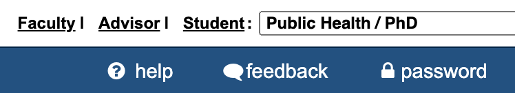
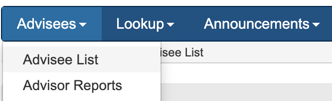
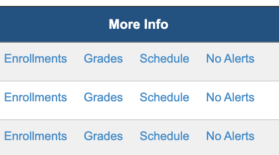
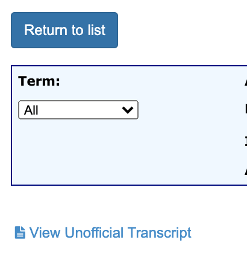

<!-- README.md is generated from README.Rmd. Please edit that file -->

# transcriptr Package:

The goal of `transcriptr` is to provide intends to give the ability to
read structured PDF files into data available for analysis and
tabulation. Currently working for Johns Hopkins Transcripts

## Installation

You can install `transcriptr` from GitHub with:

    # install.packages("remotes")
    remotes::install_github("muschellij2/transcriptr")

# JHU Transcripts

## Students

For the necessary input, please visit <https://sis.jhu.edu/sswf/>, log
in and then go to Registration → My Grades, then click \[View Unofficial
Transcript\]. This should download a `Transcript.pdf`.

# Advisors

If you are an advisor, you need to go to the Advisor Tab:

then the Advisees List:

then for an individual student, click Grades:

and then download the transcript by clicking View Unofficial Transcript:

## Reading in the Transcript

The `read_jhu_transcript` will read this in and give a `data.frame` of
the parsed output.

The Shiny app:
<https://jhubiostatistics.shinyapps.io/validate_curriculum/> should also
do this for you, allowing you to download a CSV of your data. If you
want the grades, you must check that box for the export.
